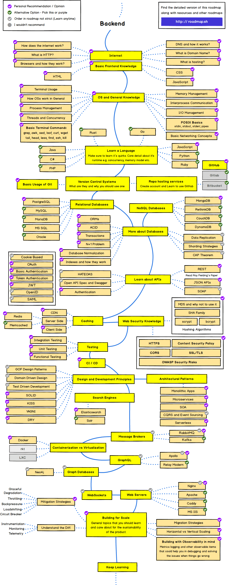

# My studies and my [CV](https://wewrgegtyj.github.io/web/).

## Roadmaps.

<details><summary>CLICK ME</summary>
<p>

#### We can hide anything, even code!

    ```ruby
      puts "Hello World"
    ```

</p>
</details>


| frontend                              |                                backend |
| :------------------------------------ | -------------------------------------: |
|  |  |
- [x] #1
- [ ] #2
- [ ] #3
- [ ] :happy: 123
  :smile: 
  $$ 3xqwe $$
  ``` rust
  fn main(){
      println!("123");
  }
  ```
``` c
    int main(){
        prinft("123");
    }
```
:+1: